# Architecture Documentation

**Last Updated**: December 24, 2025  
**Status**: Production system with 192-glacier batch processing capability

## System Overview

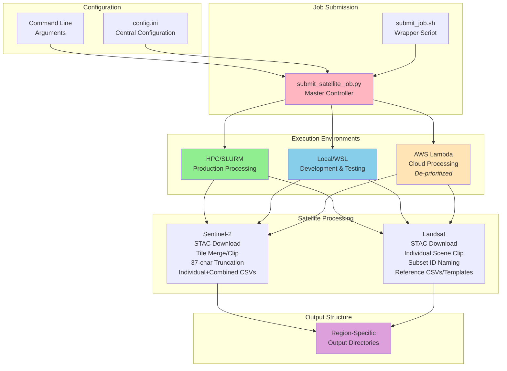

## Data Flow - Batch Processing

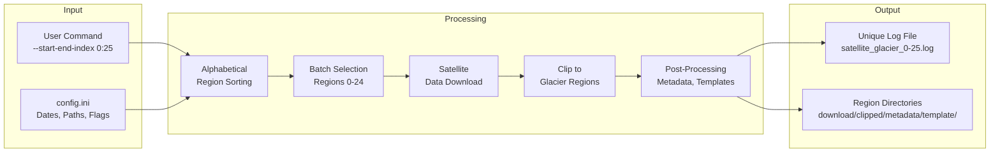

## Multi-Environment Execution Architecture

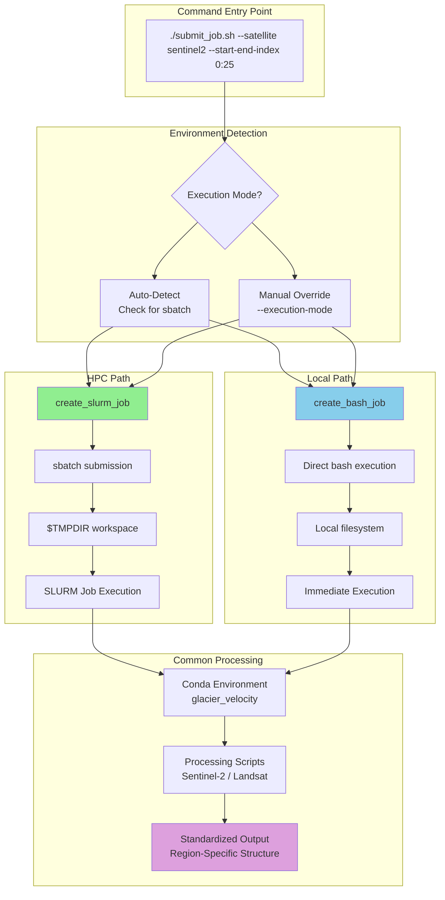

## Configuration Override Hierarchy

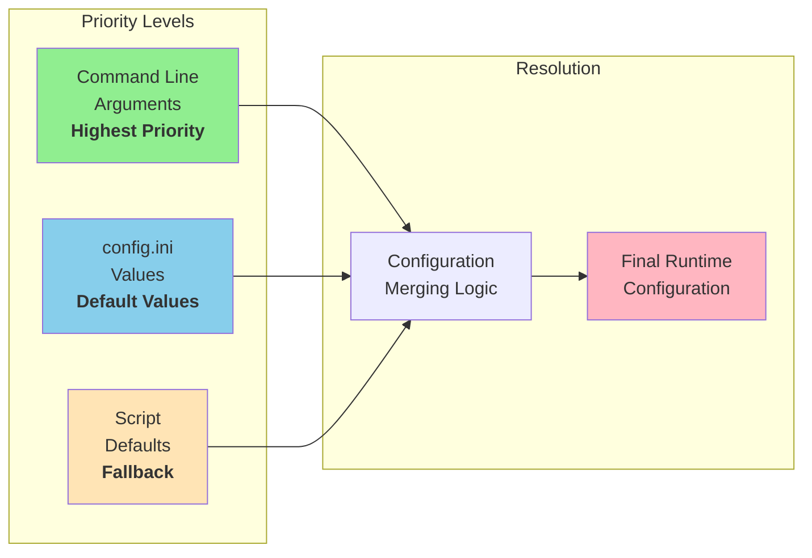

## Sentinel-2 vs Landsat Processing Flow

```mermaid
graph TB
    subgraph "Sentinel-2 Workflow"
        S2START[Start: Region List]
        S2STAC[Query STAC API<br/>Multiple MGRS Tiles]
        S2DOWN[Download Tiles<br/>~8 files per scene]
        S2MERGE[Merge Overlapping Tiles<br/>Create Mosaic]
        S2CLIP[Clip to Glacier ROI]
        S2META[Generate Metadata]
        S2OUT[Output Structure<br/>sentinel2/region/download/clipped/metadata/template/]
    end
    
    subgraph "Landsat Workflow"
        LSSTART[Start: Region List]
        LSSTAC[Query STAC API<br/>Single Scene]
        LSDOWN[Download Scene<br/>1-2 files per date]
        LSCLIP[Clip to Glacier ROI]
        LSMETA[Generate Metadata]
        LSOUT[Output Structure<br/>landsat/region/ + _reference/]
    end
    
    S2START --> S2STAC
    S2STAC --> S2DOWN
    S2DOWN --> S2MERGE
    S2MERGE --> S2CLIP
    S2CLIP --> S2META
    S2META --> S2OUT
    
    LSSTART --> LSSTAC
    LSSTAC --> LSDOWN
    LSDOWN --> LSCLIP
    LSCLIP --> LSMETA
    LSMETA --> LSOUT
    
    style S2MERGE fill:#FFB6C1
    style LSCLIP fill:#90EE90
```

## Batch Processing: Region Sorting & Selection

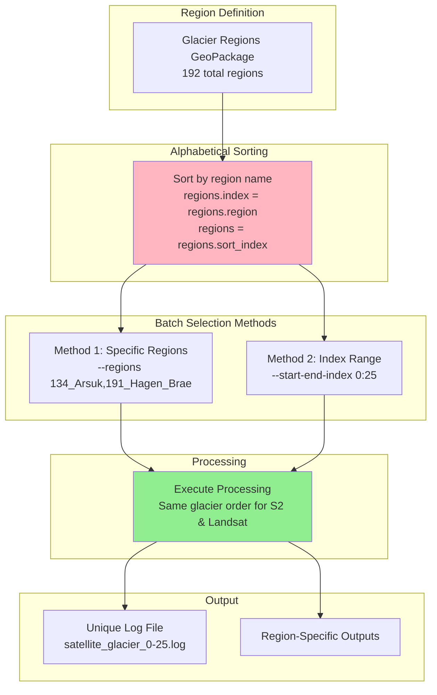

## Output Structure: "Old" vs "New" (Current vs Future)

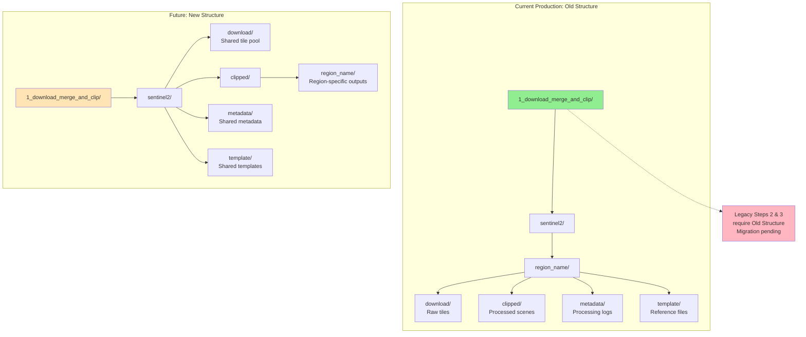

## Automatic Log Naming Logic

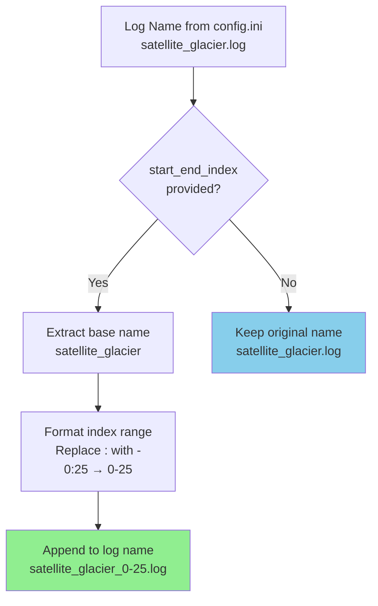

## Key Architecture Decisions

### 1. Multi-Satellite Unified Interface
- **Decision**: Single `submit_satellite_job.py` handles both Sentinel-2 and Landsat
- **Rationale**: Consistent command interface, shared configuration, easier maintenance
- **Implementation**: Conditional logic based on `--satellite` parameter

### 2. Multi-Environment Support
- **Decision**: Same code runs on HPC, local, and AWS Lambda
- **Rationale**: Prototyping on local before HPC deployment, cloud backup option
- **Implementation**: Separate execution functions with auto-detection

### 3. Configuration-Driven Workflow
- **Decision**: INI configuration with CLI overrides
- **Rationale**: Easy editing, team collaboration, testing flexibility
- **Implementation**: ConfigParser + argparse with priority hierarchy

### 4. Alphabetical Region Sorting
- **Decision**: Both satellites use identical alphabetical sorting
- **Rationale**: Predictable batching, reproducibility, consistent results
- **Implementation**: `regions.index = regions.region; regions.sort_index()`

### 5. Automatic Log Naming
- **Decision**: Append batch range to log filename automatically
- **Rationale**: Prevent concurrent job conflicts, self-documenting logs
- **Implementation**: Parse `start_end_index`, format as suffix

### 6. Region-Specific Output Structure
- **Decision**: Keep "old" structure with region as parent directory
- **Rationale**: Legacy Steps 2 & 3 expect this structure
- **Future**: May migrate to "new" shared download pool when downstream updated

## Performance Characteristics

### Resource Requirements (Full Year Processing)

| Satellite | Processing Time | Memory | Output Size | Batch Size |
|-----------|----------------|--------|-------------|------------|
| Sentinel-2 | 25 hours/batch | 60 GB | 50-100 GB/glacier | 25 glaciers |
| Landsat | 25 hours/batch | 60 GB | 1-5 GB/glacier | 100 glaciers |

### Scalability

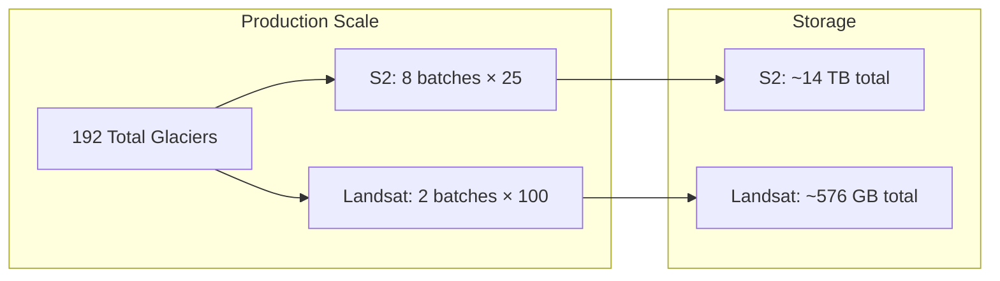

## Technology Stack

### Core Technologies
- **Language**: Python 3.x
- **Package Manager**: Conda/Miniforge (HPC/local), pip (AWS Lambda)
- **Scheduler**: SLURM (HPC)
- **Cloud**: AWS Lambda + S3 (de-prioritized)

### Key Libraries
- **Geospatial**: rioxarray, rasterio, GDAL, geopandas
- **Data**: xarray, numpy, pandas
- **APIs**: planetary-computer (STAC), boto3 (AWS)

### Infrastructure
- **HPC**: OSC clusters (Owens, Pitzer)
- **Local Dev**: WSL/Ubuntu on Windows
- **Cloud**: AWS Lambda containers (1.4 GB, Python 3.12)

## Evolution Timeline

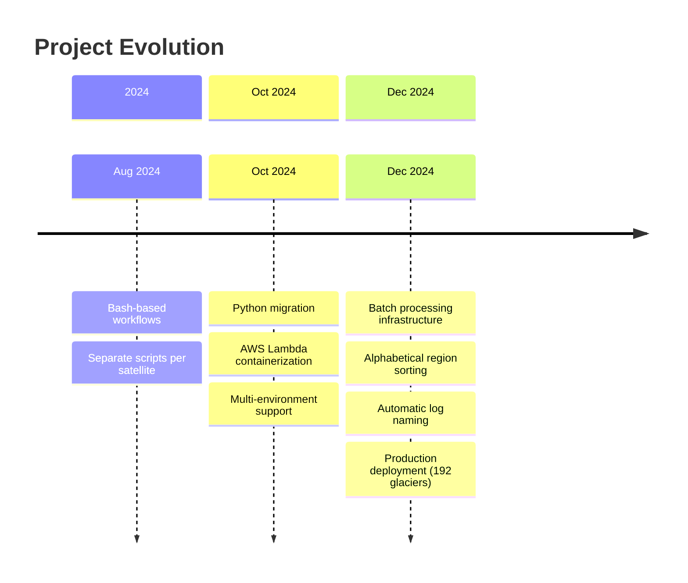

## Metadata and Reference Data Architecture

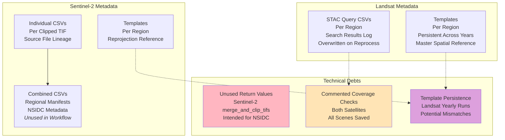

## Related Documentation

- [README.md](../README.md) - Project overview and quick start
- [AGENTS.md](../AGENTS.md) - Comprehensive development guide
- [PRODUCTION_WORKFLOW.md](../PRODUCTION_WORKFLOW.md) - Operations manual
- [CHANGELOG.md](../CHANGELOG.md) - Version history
- [docs/technical/](technical/) - Technical implementation details

---

**Note**: These diagrams are created using Mermaid syntax and render natively on GitHub. To view locally, use a Mermaid-compatible Markdown viewer or the Mermaid Live Editor: https://mermaid.live/
